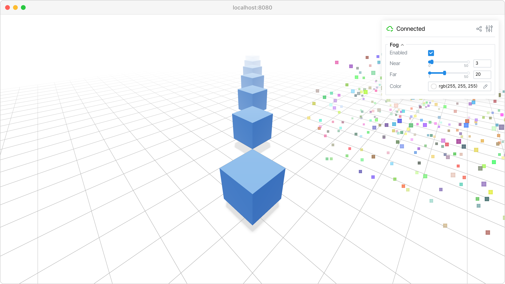

Distance fog
============

Add distance-based fog to fade objects into a background color.

This example demonstrates :meth:`viser.SceneApi.configure_fog`, which applies
linear fog to the scene. Objects between ``near`` and ``far`` will gradually
blend into the fog color, giving a sense of depth.

**Source:** ``examples/01_scene/10_fog.py``

Code
----

.. code-block:: python
   :linenos:

   import time
   
   import numpy as np
   import viser
   
   
   def main() -> None:
       server = viser.ViserServer()
   
       # Ground grid.
       server.scene.add_grid(
           "/grid",
           width=40.0,
           height=40.0,
           cell_size=1.0,
           position=(0.0, 0.0, -1.0),
       )
   
       # A row of boxes receding into the distance.
       for i in range(12):
           server.scene.add_box(
               f"/boxes/{i}",
               color=(60, 120, 200),
               position=(3.0 + i * -2.0, 3.0 + i * -2.0, 0.0),
           )
   
       # Point cloud spread along the depth axis.
       rng = np.random.default_rng(0)
       num_points = 2000
       server.scene.add_point_cloud(
           "/points",
           points=rng.uniform((-5, 0, -2), (5, 35, 2), size=(num_points, 3)).astype(
               np.float32
           ),
           colors=rng.integers(80, 255, size=(num_points, 3), dtype=np.uint8),
           point_size=0.06,
           position=(-8.0, 0.0, 0.0),
       )
   
       # Gaussian splats scattered into the distance.
       num_splats = 500
       server.scene.add_gaussian_splats(
           "/splats",
           centers=rng.uniform((-4, 2, -1), (4, 35, 2), size=(num_splats, 3)).astype(
               np.float32
           ),
           covariances=np.tile(0.01 * np.eye(3, dtype=np.float32), (num_splats, 1, 1)),
           rgbs=rng.uniform(0.3, 1.0, size=(num_splats, 3)).astype(np.float32),
           opacities=rng.uniform(0.6, 1.0, size=(num_splats, 1)).astype(np.float32),
           position=(8.0, 0.0, 0.0),
       )
   
       # Configure fog.
       server.scene.configure_fog(near=3.0, far=20.0, color=(255, 255, 255))
   
       # GUI controls.
       with server.gui.add_folder("Fog"):
           gui_enabled = server.gui.add_checkbox("Enabled", initial_value=True)
           gui_near = server.gui.add_slider(
               "Near", min=0.0, max=50.0, step=0.5, initial_value=3.0
           )
           gui_far = server.gui.add_slider(
               "Far", min=1.0, max=50.0, step=0.5, initial_value=20.0
           )
           gui_color = server.gui.add_rgb("Color", initial_value=(255, 255, 255))
   
       def update_fog(_) -> None:
           server.scene.configure_fog(
               gui_near.value,
               gui_far.value,
               color=gui_color.value,
               enabled=gui_enabled.value,
           )
   
       gui_enabled.on_update(update_fog)
       gui_near.on_update(update_fog)
       gui_far.on_update(update_fog)
       gui_color.on_update(update_fog)
   
       while True:
           time.sleep(10.0)
   
   
   if __name__ == "__main__":
       main()
   
